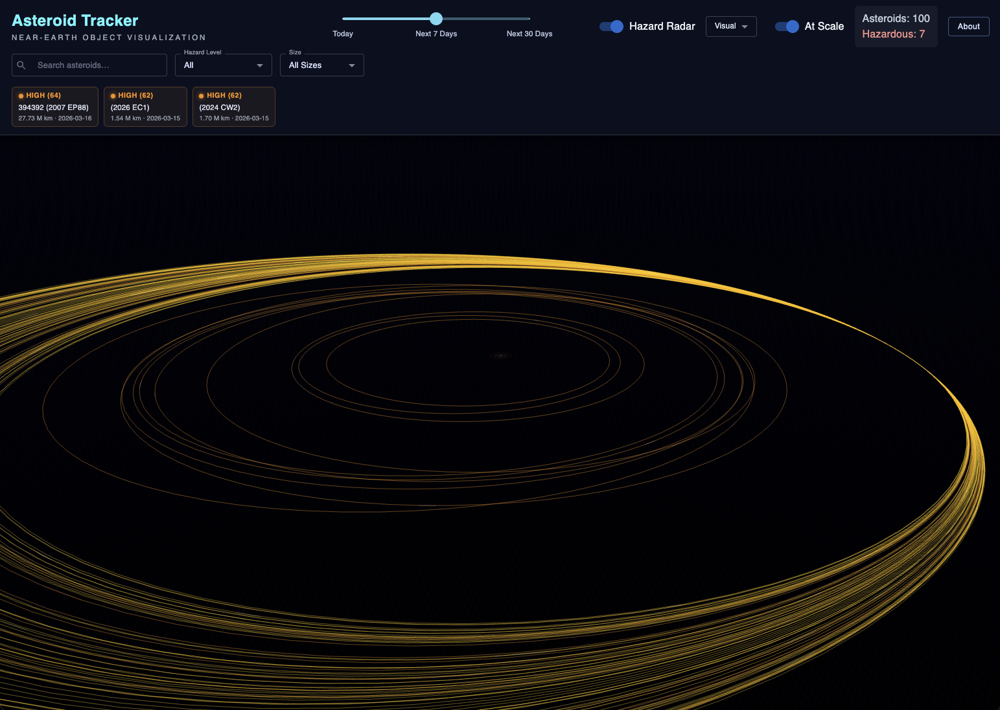

# Asteroid Tracker

 

Asteroid Tracker is an interactive React + ThreeJS experience that visualizes Near-Earth Objects (NEOs) from NASA's public APIs. It renders Earth in the center of a cinematic 3D scene and animates asteroids in orbit trajectories, with hazard-focused radar mode and real-time asteroid details.

## Feature Overview

- Real NASA NEO data integration (date-range based)
- Rotating textured Earth with atmospheric glow
- Animated asteroid motion around Earth
- Hazard-aware coloring and glow intensity
- Threat scoring (0-100) based on miss distance, size, speed, and approach date
- Orbit trajectories and fading asteroid trails
- Hover labels and click-to-inspect asteroid panel
- Asteroid search and filter by name, hazard level, and size
- Previous / next navigation between asteroids with selection highlight
- Time range slider: today, next 7 days, next 30 days
- Radar hazard mode with threat-driven pulse speed and color
- Earth-centered hazard zone bands (safe/caution/high)
- Radar presets: Visual, Risk Weighted, Imminent Only
- Top-3 ranked hazard panel with quick-select cards
- Cinematic deep-space background

## Architecture

### Data Layer

- `src/utils/api.js`
  - Uses Axios to call NASA's NEO feed endpoint with API key from environment variables.
- `src/hooks/useAsteroids.js`
  - Fetches by date window, normalizes the response, computes orbit metadata and threat score, and exposes loading/stats.

### Risk + Threat Modeling

- `src/utils/threatScore.js`
  - Computes a weighted threat score (0-100) per asteroid.
  - Exposes threat level labels and color mapping helpers.

### Math + Simulation

- `src/utils/orbitMath.js`
  - Builds deterministic orbit parameters from asteroid metadata.
  - Computes per-frame positions and distance-based visual scaling.

### Rendering Layer

- `src/components/Earth.jsx`
  - Textured Earth, atmosphere shader, directional lighting response.
- `src/components/AsteroidField.jsx`
  - Maps over asteroid data to render orbit lines + asteroid bodies.
- `src/components/Asteroid.jsx`
  - Per-asteroid animation loop, rocky body rendering, threat-aware glow, and selection outline.
- `src/components/AsteroidTrail.jsx`
  - Recent-position history rendered as additive fading trail.
- `src/components/Radar.jsx`
  - Threat-driven radar pulses plus Earth-centered hazard zone bands.

### UI Layer

- `src/components/TopBar.jsx`
  - Displays title, time slider, radar toggle, radar mode presets, counters, loading indicator, and ranked hazard cards.
- `src/components/InfoPanel.jsx`
  - Displays selected asteroid details with smooth fade animation, threat chip, and previous/next navigation.
- `src/components/SearchFilter.jsx`
  - Search input and dropdowns to filter asteroids by name, hazard level, and size.
- `src/components/ThreatPanel.jsx`
  - Shows top 3 highest-threat asteroids with keyboard-accessible quick selection.
- Material UI components and `sx` styling for a consistent UI layer.

## Hazard Radar Modes

- `Visual`
  - Shows radar pulses and hazard zones for situational awareness.
- `Risk Weighted`
  - Highlights asteroids and orbits by threat score color intensity.
- `Imminent Only`
  - Focuses view on asteroids approaching within 7 days.

## How to Use Hazard Radar

1. Turn on `Hazard Radar` in the top header.
2. Choose a radar preset:
  - `Visual`: ambient situational scan with pulse rings and hazard zones.
  - `Risk Weighted`: emphasizes objects and orbits by threat score.
  - `Imminent Only`: narrows focus to near-term approaches (next 7 days).
3. Watch the pulse behavior around Earth:
  - Faster pulse speed indicates higher active threat in the current dataset.
  - Pulse color shifts from green/yellow to orange/red as risk increases.
4. Use the top `Threat` cards (Top 3) to jump directly to high-risk asteroids.
5. Click an asteroid (or use search/autocomplete) to inspect details:
  - Name, diameter, velocity, miss distance, close-approach date.
  - Hazard badge and threat label/score in the details panel.
6. Keep `At Scale` on for physically scaled distance context, or off for easier visual comparison.

Tip: For demos, start in `Risk Weighted`, select a top threat from the header cards, then switch to `Imminent Only` to show decision-focused filtering.

## Threat Score Formula (High-Level)

Threat score combines:

- Proximity (miss distance)
- Size (diameter)
- Velocity
- Urgency (days until approach)
- Hazardous flag bonus

The result is a normalized `0-100` score used by radar pulse behavior, orbit coloring, ranked hazard cards, and threat badges.


## Installation

1. Install dependencies:

```bash
npm install
```

2. Configure environment variables:

```bash
cp .env.example .env
```

3. Add your NASA API key in `.env`:

```env
VITE_NASA_API_KEY=YOUR_KEY_HERE
```

4. Run the app:

```bash
npm run dev
```

5. Open the local URL printed by Vite.

## NASA API Notes

- API base: `https://api.nasa.gov/`
- Endpoint used: NEO feed (`/neo/rest/v1/feed`)
- Date range must stay within NASA NEO feed limits.

## Future Features

- Realistic orbital mechanics with ephemeris models
- VR mode for immersive asteroid exploration
- Collision prediction and simulation overlays
- Earth satellite and debris tracking layers

## License

MIT (recommended for open educational repositories).
